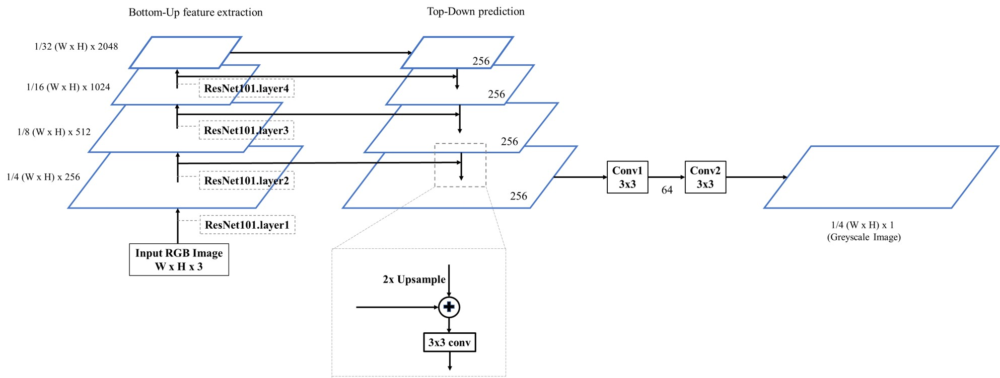

# Depth-Estimation-PyTorch
Monocular depth estimation using Feature Pyramid Network implemented in PyTorch 1.1.0

## To test the model I provide
Change your working directory to ```model-test```, then run the Jupyter Notebook in ```test.ipynb```

**Note**: the model I provide was trained only on a dataset containing 1k images of scenes in basements. The purpose of this model was only to test whether the network architecture works for depth estimation. The test dataset provided in ```model-test``` folder also contains only images of basements.

## To train your own model
#### Requirements
- Python3
- PyTorch (The version in my code is PyTorch 1.1.0)
- CUDA (It's almost impossible to train on a CPU because the network is very deep)
#### Prepare your own dataset
As the dataset is very large, I didn't provide them directly in this repository. However, you can download the depth dataset and load them with your own code.

Modify the code of the data loading part in ```fyn_main.py``` first to ensure that you can load the dataset correctly. In my original code, I store the RGB and depth images in two folders and have a pickle file to relate them, both for train dataset and test dataset.

- [NYU Depth V2 Dataset](https://cs.nyu.edu/~silberman/datasets/nyu_depth_v2.html): This is the dataset I used in my code for the training of the network. If you want to train on this dataset, then you can refer to my script ```process_dataset.py``` to process the data you download. Again, after you have processed the data, you need to check the data loading part to see if you can load the dataset correctly.
- Training on other datasets: You can also use the architecture to train on other datasets, like [KITTI](http://www.cvlibs.net/datasets/kitti/eval_depth.php?benchmark=depth_prediction), [InteriorNet](https://interiornet.org/), [MannequinChallenge dataset](https://mannequin-depth.github.io/), which all contains depth map data. You will need to do the data processing and data loading step on your own. Also, although the RGB image size and depth image size might be different from NyuV2, it can still be trained using the same network architecture. Just remember the neural network takes a ```Width x Height x 3``` RGB image as input and ouputs a ``` 1/4 Width x 1/4 Height x 1``` grayscale image.
#### Start training
After you make sure the dataset can be loaded correctly, you can run ```fyn_main.py``` to start training.

## Architecture




## Dataset
We use the [NYU Depth V2 Dataset](https://cs.nyu.edu/~silberman/datasets/nyu_depth_v2.html) for training and testing. The RGB image and the depth image in the dataset are both of size 640x480. During training, the RGB image is loaded as 640x480 and the depth image is loaded and then resized to 160x120. The input of the network is a RGB image with size 640x480, and the output is a grayscale image of size 160x120, which is the depth map we need.

NyuV2 dataset contains images of indoor scenes, which is a limitation for depth estimation on other scenes. You can check other dataset to include more scenes in your model.

## Loss Function
We employed a self-defined loss function in our model -- the Depth Loss:


## Results
Here are some results on test dataset that contains scenes of basements:

## Reference
- [Feature Pyramid Network](https://arxiv.org/abs/1612.03144)
- [GitHub--MonoDepth-FPN-PyTorch](https://github.com/xanderchf/MonoDepth-FPN-PyTorch)
- [ResNet101](http://ethereon.github.io/netscope/#/gist/b21e2aae116dc1ac7b50)
- [深度学习之单目深度估计 (Chapter.1)：基础篇](https://zhuanlan.zhihu.com/p/29864012)
- [基于深度学习的单目图像深度估计](https://www.cnblogs.com/jukan/p/10151898.html)
- [Single-Image Depth Perception in the Wild](http://www-personal.umich.edu/~wfchen/depth-in-the-wild/)